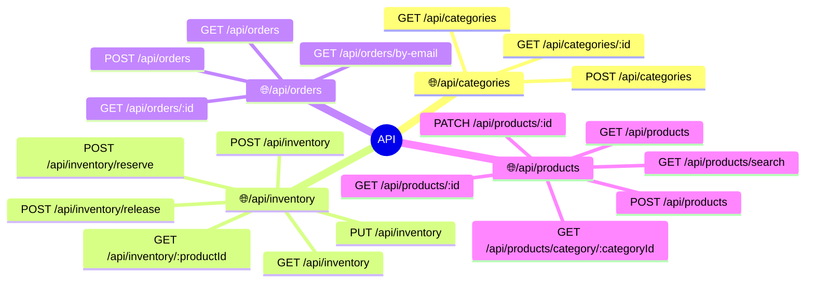
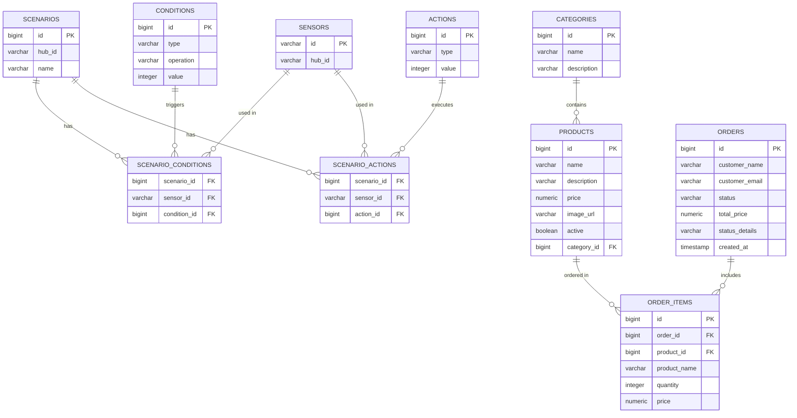

# smart-home-tech

**Проект умного дома** - система сбора и анализа данных от датчиков умного дома, 
для последующего выполнения устройствами необходимых действий (например включение света).

### Microservice map

### Http API

### Database map

